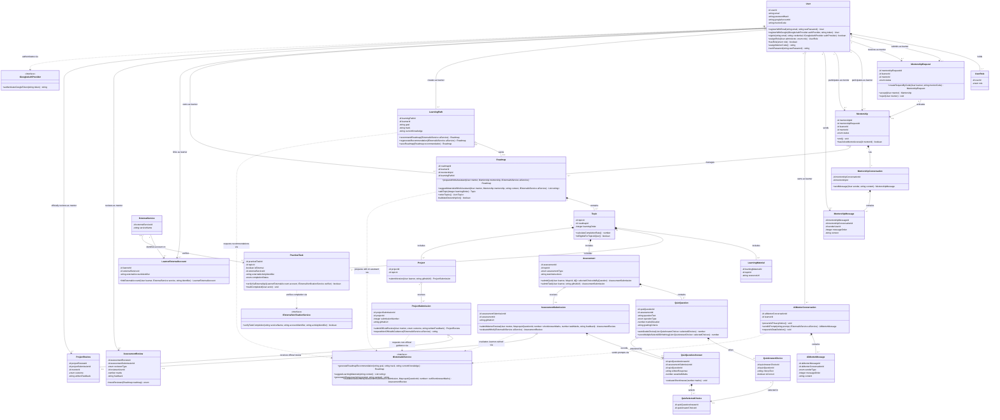

```mermaid
classDiagram
    class IGoogleAuthProvider {
        <<interface>>
        +authenticateGoogleToken(string token) string
    }

    class IExternalAiService {
        <<interface>>
        +generateRoadmapRecommendation(string goal, string track, string currentKnowledge) Roadmap
        +suggestLearningMaterials(string context) List~string~
        +generateAiResponse(string prompt, string context) string
        +evaluateAssessment(AssessmentSubmission submission, Map~quizQuestionId, number~ outShortAnswerMarks) AssessmentReview
    }

    class IExternalVerificationService {
        <<interface>>
        +verifyTaskCompletion(string serviceName, string accountIdentifier, string activityIdentifier) boolean
    }

    class User {
        -id userId
        -string email
        -string passwordHash
        -string googleAccountId
        -string mentorCode
        +registerWithEmail(string email, string rawPassword) User
        +registerWithGoogle(IGoogleAuthProvider authProvider, string token) User
        +signIn(string email, string credential, IGoogleAuthProvider authProvider) boolean
        +assignRole(User adminActor, enum role) UserRole
        +hasRole(enum role) boolean
        +assignMentorCode() string
        -hashPassword(string rawPassword) string
    }

    class UserRole {
        -id userId
        -enum role
    }

    class MentorshipRequest {
        -id mentorshipRequestId
        -id learnerId
        -id mentorId
        -enum status
        +createRequestByCode(User learner, string mentorCode) MentorshipRequest
        +accept(User mentor) Mentorship
        +reject(User mentor) void
    }

    class Mentorship {
        -id mentorshipId
        -id mentorshipRequestId
        -id learnerId
        -id mentorId
        -enum status
        +end() void
        +hasActiveMentorAccess(id mentorId) boolean
    }

    class MentorshipConversation {
        -id mentorshipConversationId
        -id mentorshipId
        +sendMessage(User sender, string content) MentorshipMessage
    }

    class MentorshipMessage {
        -id mentorshipMessageId
        -id mentorshipConversationId
        -id senderUserId
        -integer messageOrder
        -string content
    }

    class AiMentorConversation {
        -id aiMentorConversationId
        -id learnerId
        +presentAiPrivacyNotice() void
        +sendAiPrompt(string prompt, IExternalAiService aiService) AiMentorMessage
        +requestAiDataDeletion() void
    }

    class AiMentorMessage {
        -id aiMentorMessageId
        -id aiMentorConversationId
        -enum senderType
        -integer messageOrder
        -string content
    }

    class LearningPath {
        -id learningPathId
        -id learnerId
        -string goal
        -string track
        -string currentKnowledge
        +recommendRoadmap(IExternalAiService aiService) Roadmap
        +regenerateRecommendation(IExternalAiService aiService) Roadmap
        +saveRoadmap(Roadmap recommendation) Roadmap
    }

    class Roadmap {
        -id roadmapId
        -id learnerId
        -id mentorshipId
        -id learningPathId
        +prepareWithAiAssistant(User mentor, Mentorship mentorship, IExternalAiService aiService) Roadmap
        +suggestMaterialsWithAiAssistant(User mentor, Mentorship mentorship, string context, IExternalAiService aiService) List~string~
        +addTopic(integer learningOrder) Topic
        +orderTopics() List~Topic~
        #validateOwnershipXor() boolean
    }

    class Topic {
        -id topicId
        -id roadmapId
        -integer learningOrder
        +calculateCompletionRate() number
        +isEligibleForTopicAiQuiz() boolean
    }

    class LearningMaterial {
        -id learningMaterialId
        -id topicId
        -string resourceUrl
    }

    class ExternalService {
        -id externalServiceId
        -string serviceName
    }

    class LearnerExternalAccount {
        -id learnerId
        -id externalServiceId
        -string externalAccountIdentifier
        +linkExternalAccount(User learner, ExternalService service, string identifier) LearnerExternalAccount
    }

    class PracticalTask {
        -id practicalTaskId
        -id topicId
        -boolean isExternal
        -id externalServiceId
        -string externalActivityIdentifier
        -enum completionStatus
        +verifyViaExternalApi(LearnerExternalAccount account, IExternalVerificationService verifier) boolean
        +markCompleted(User actor) void
    }

    class Assessment {
        -id assessmentId
        -id topicId
        -enum assessmentType
        -string taskInstructions
        +submitQuiz(User learner, Map~id, string~ writtenResponses, Map~id, id[]~ selectedChoiceIdsByQuestion) AssessmentSubmission
        +submitTask(User learner, string githubUrl) AssessmentSubmission
    }

    class QuizQuestion {
        -id quizQuestionId
        -id assessmentId
        -string questionText
        -enum questionType
        -number markAllocation
        -string gradingCriteria
        +autoGradeChoice(List~QuizAnswerChoice~ selectedChoices) number
        +scoreMultipleSelectAllOrNothing(List~QuizAnswerChoice~ selectedChoices) number
    }

    class QuizAnswerChoice {
        -id quizAnswerChoiceId
        -id quizQuestionId
        -string choiceText
        -boolean isCorrect
    }

    class AssessmentSubmission {
        -id assessmentSubmissionId
        -id assessmentId
        -string githubUrl
        +submitMentorReview(User mentor, Map~quizQuestionId, number~ shortAnswerMarks, number taskMarks, string feedback) AssessmentReview
        +evaluateWithAi(IExternalAiService aiService) AssessmentReview
    }

    class QuizQuestionAnswer {
        -id quizQuestionAnswerId
        -id assessmentSubmissionId
        -id quizQuestionId
        -string writtenResponse
        -number awardedMarks
        ~evaluateShortAnswer(number marks) void
    }

    class QuizSelectedChoice {
        -id quizQuestionAnswerId
        -id quizAnswerChoiceId
    }

    class AssessmentReview {
        -id assessmentReviewId
        -id assessmentSubmissionId
        -enum reviewerType
        -id reviewerUserId
        -number marks
        -string feedback
        #routeReviewer(Roadmap roadmap) enum
    }

    class Project {
        -id projectId
        -id topicId
        +submitVersion(User learner, string githubUrl) ProjectSubmission
    }

    class ProjectSubmission {
        -id projectSubmissionId
        -id projectId
        -integer submissionNumber
        -string githubUrl
        +submitOfficialReview(User mentor, enum outcome, string writtenFeedback) ProjectReview
        +requestNonOfficialAiGuidance(IExternalAiService aiService) string
    }

    class ProjectReview {
        -id projectReviewId
        -id projectSubmissionId
        -id mentorId
        -enum outcome
        -string writtenFeedback
    }

    User "1" *-- "1..*" UserRole : holds
    User "1" --> "0..*" MentorshipRequest : submits as learner
    User "1" --> "0..*" MentorshipRequest : receives as mentor
    MentorshipRequest "1" --> "0..1" Mentorship : activates
    User "1" --> "0..*" Mentorship : participates as learner
    User "1" --> "0..*" Mentorship : participates as mentor
    Mentorship "1" *-- "1" MentorshipConversation : has
    MentorshipConversation "1" *-- "0..*" MentorshipMessage : contains
    User "1" --> "0..*" MentorshipMessage : sends
    User "1" o-- "0..*" AiMentorConversation : owns as learner
    AiMentorConversation "1" *-- "0..*" AiMentorMessage : contains
    User "1" o-- "0..*" LearningPath : creates as learner
    User "1" o-- "0..*" Roadmap : owns as learner
    Mentorship "0..1" o-- "0..*" Roadmap : manages
    LearningPath "0..1" o-- "0..1" Roadmap : saves
    Roadmap "1" *-- "1..*" Topic : contains
    Topic "1" *-- "0..*" LearningMaterial : includes
    User "1" --> "0..*" LearnerExternalAccount : links as learner
    ExternalService "1" --> "0..*" LearnerExternalAccount : identifies account on
    Topic "1" *-- "0..*" PracticalTask : includes
    ExternalService "0..1" --> "0..*" PracticalTask : verifies
    Topic "1" *-- "0..*" Assessment : includes
    Assessment "1" *-- "0..*" QuizQuestion : contains
    QuizQuestion "1" *-- "0..*" QuizAnswerChoice : offers
    Assessment "1" o-- "0..1" AssessmentSubmission : receives
    AssessmentSubmission "1" *-- "0..*" QuizQuestionAnswer : records
    QuizQuestion "1" --> "0..1" QuizQuestionAnswer : answered by
    QuizQuestionAnswer "1" *-- "0..*" QuizSelectedChoice : selects
    QuizAnswerChoice "1" --> "0..1" QuizSelectedChoice : selected in
    AssessmentSubmission "1" o-- "0..1" AssessmentReview : evaluated by
    User "0..1" --> "0..*" AssessmentReview : reviews as mentor
    Topic "1" *-- "0..*" Project : includes
    Project "1" o-- "0..*" ProjectSubmission : receives
    ProjectSubmission "1" o-- "0..1" ProjectReview : receives official review
    User "1" --> "0..*" ProjectReview : officially reviews as mentor

    User ..> IGoogleAuthProvider : authenticates via
    AiMentorConversation ..> IExternalAiService : sends prompts via
    LearningPath ..> IExternalAiService : requests recommendations via
    Roadmap ..> IExternalAiService : prepares with AI assistant via
    AssessmentSubmission ..> IExternalAiService : evaluates Learner-owned via
    ProjectSubmission ..> IExternalAiService : requests non-official guidance via
    PracticalTask ..> IExternalVerificationService : verifies completion via
```
