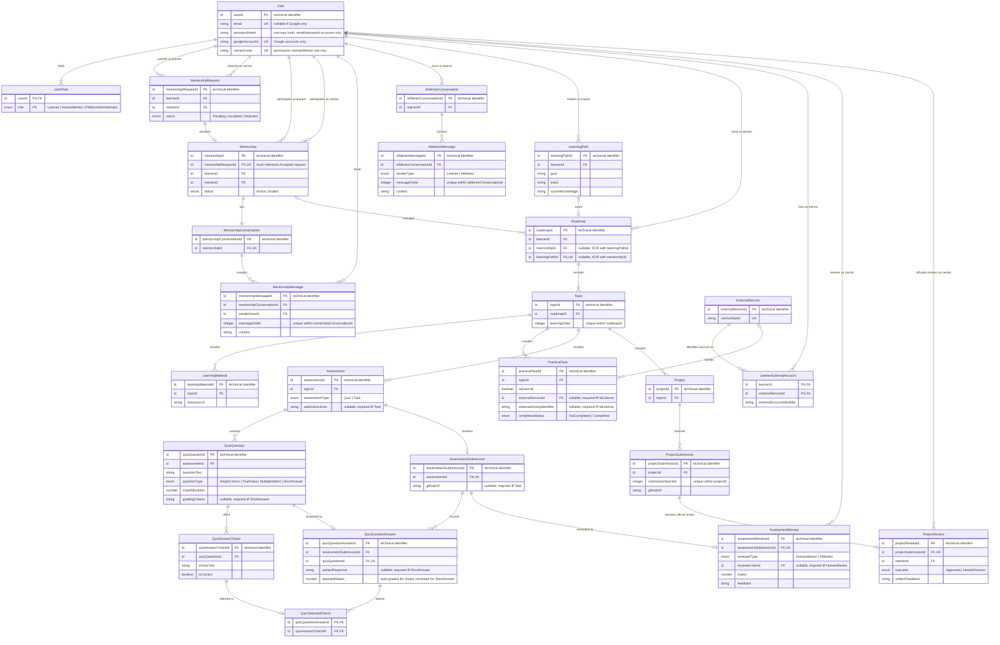

```mermaid
erDiagram
    User {
        id userId PK "technical identifier"
        string email UK "nullable if Google-only"
        string passwordHash "one-way hash; email/password accounts only"
        string googleAccountId UK "Google accounts only"
        string mentorCode UK "permanent; HumanMentor role only"
    }

    UserRole {
        id userId PK,FK
        enum role PK "Learner | HumanMentor | PlatformAdministrator"
    }

    MentorshipRequest {
        id mentorshipRequestId PK "technical identifier"
        id learnerId FK
        id mentorId FK
        enum status "Pending | Accepted | Rejected"
    }

    Mentorship {
        id mentorshipId PK "technical identifier"
        id mentorshipRequestId FK,UK "must reference Accepted request"
        id learnerId FK
        id mentorId FK
        enum status "Active | Ended"
    }

    MentorshipConversation {
        id mentorshipConversationId PK "technical identifier"
        id mentorshipId FK,UK
    }

    MentorshipMessage {
        id mentorshipMessageId PK "technical identifier"
        id mentorshipConversationId FK
        id senderUserId FK
        integer messageOrder "unique within mentorshipConversationId"
        string content
    }

    AiMentorConversation {
        id aiMentorConversationId PK "technical identifier"
        id learnerId FK
    }

    AiMentorMessage {
        id aiMentorMessageId PK "technical identifier"
        id aiMentorConversationId FK
        enum senderType "Learner | AiMentor"
        integer messageOrder "unique within aiMentorConversationId"
        string content
    }

    LearningPath {
        id learningPathId PK "technical identifier"
        id learnerId FK
        string goal
        string track
        string currentKnowledge
    }

    Roadmap {
        id roadmapId PK "technical identifier"
        id learnerId FK
        id mentorshipId FK "nullable; XOR with learningPathId"
        id learningPathId FK,UK "nullable; XOR with mentorshipId"
    }

    Topic {
        id topicId PK "technical identifier"
        id roadmapId FK
        integer learningOrder "unique within roadmapId"
    }

    LearningMaterial {
        id learningMaterialId PK "technical identifier"
        id topicId FK
        string resourceUrl
    }

    ExternalService {
        id externalServiceId PK "technical identifier"
        string serviceName UK
    }

    LearnerExternalAccount {
        id learnerId PK,FK
        id externalServiceId PK,FK
        string externalAccountIdentifier
    }

    PracticalTask {
        id practicalTaskId PK "technical identifier"
        id topicId FK
        boolean isExternal
        id externalServiceId FK "nullable; required iff isExternal"
        string externalActivityIdentifier "nullable; required iff isExternal"
        enum completionStatus "NotCompleted | Completed"
    }

    Assessment {
        id assessmentId PK "technical identifier"
        id topicId FK
        enum assessmentType "Quiz | Task"
        string taskInstructions "nullable; required iff Task"
    }

    QuizQuestion {
        id quizQuestionId PK "technical identifier"
        id assessmentId FK
        string questionText
        enum questionType "SingleChoice | TrueFalse | MultipleSelect | ShortAnswer"
        number markAllocation
        string gradingCriteria "nullable; required iff ShortAnswer"
    }

    QuizAnswerChoice {
        id quizAnswerChoiceId PK "technical identifier"
        id quizQuestionId FK
        string choiceText
        boolean isCorrect
    }

    AssessmentSubmission {
        id assessmentSubmissionId PK "technical identifier"
        id assessmentId FK,UK
        string githubUrl "nullable; required iff Task"
    }

    QuizQuestionAnswer {
        id quizQuestionAnswerId PK "technical identifier"
        id assessmentSubmissionId FK
        id quizQuestionId FK,UK
        string writtenResponse "nullable; required iff ShortAnswer"
        number awardedMarks "auto-graded for choice; reviewed for ShortAnswer"
    }

    QuizSelectedChoice {
        id quizQuestionAnswerId PK,FK
        id quizAnswerChoiceId PK,FK
    }

    AssessmentReview {
        id assessmentReviewId PK "technical identifier"
        id assessmentSubmissionId FK,UK
        enum reviewerType "HumanMentor | AiMentor"
        id reviewerUserId FK "nullable; required iff HumanMentor"
        number marks
        string feedback
    }

    Project {
        id projectId PK "technical identifier"
        id topicId FK
    }

    ProjectSubmission {
        id projectSubmissionId PK "technical identifier"
        id projectId FK
        integer submissionNumber "unique within projectId"
        string githubUrl
    }

    ProjectReview {
        id projectReviewId PK "technical identifier"
        id projectSubmissionId FK,UK
        id mentorId FK
        enum outcome "Approved | NeedsRevision"
        string writtenFeedback
    }

    User ||--|{ UserRole : "holds"
    User ||--o{ MentorshipRequest : "submits as learner"
    User ||--o{ MentorshipRequest : "receives as mentor"
    MentorshipRequest ||--o| Mentorship : "activates"
    User ||--o{ Mentorship : "participates as learner"
    User ||--o{ Mentorship : "participates as mentor"
    Mentorship ||--|| MentorshipConversation : "has"
    MentorshipConversation ||--o{ MentorshipMessage : "contains"
    User ||--o{ MentorshipMessage : "sends"
    User ||--o{ AiMentorConversation : "owns as learner"
    AiMentorConversation ||--o{ AiMentorMessage : "contains"
    User ||--o{ LearningPath : "creates as learner"
    User ||--o{ Roadmap : "owns as learner"
    Mentorship |o--o{ Roadmap : "manages"
    LearningPath |o--o| Roadmap : "saves"
    Roadmap ||--|{ Topic : "contains"
    Topic ||--o{ LearningMaterial : "includes"
    User ||--o{ LearnerExternalAccount : "links as learner"
    ExternalService ||--o{ LearnerExternalAccount : "identifies account on"
    Topic ||--o{ PracticalTask : "includes"
    ExternalService |o--o{ PracticalTask : "verifies"
    Topic ||--o{ Assessment : "includes"
    Assessment ||--o{ QuizQuestion : "contains"
    QuizQuestion ||--o{ QuizAnswerChoice : "offers"
    Assessment ||--o| AssessmentSubmission : "receives"
    AssessmentSubmission ||--o{ QuizQuestionAnswer : "records"
    QuizQuestion ||--o| QuizQuestionAnswer : "answered by"
    QuizQuestionAnswer ||--o{ QuizSelectedChoice : "selects"
    QuizAnswerChoice ||--o| QuizSelectedChoice : "selected in"
    AssessmentSubmission ||--o| AssessmentReview : "evaluated by"
    User |o--o{ AssessmentReview : "reviews as mentor"
    Topic ||--o{ Project : "includes"
    Project ||--o{ ProjectSubmission : "receives"
    ProjectSubmission ||--o| ProjectReview : "receives official review"
    User ||--o{ ProjectReview : "officially reviews as mentor"
```
